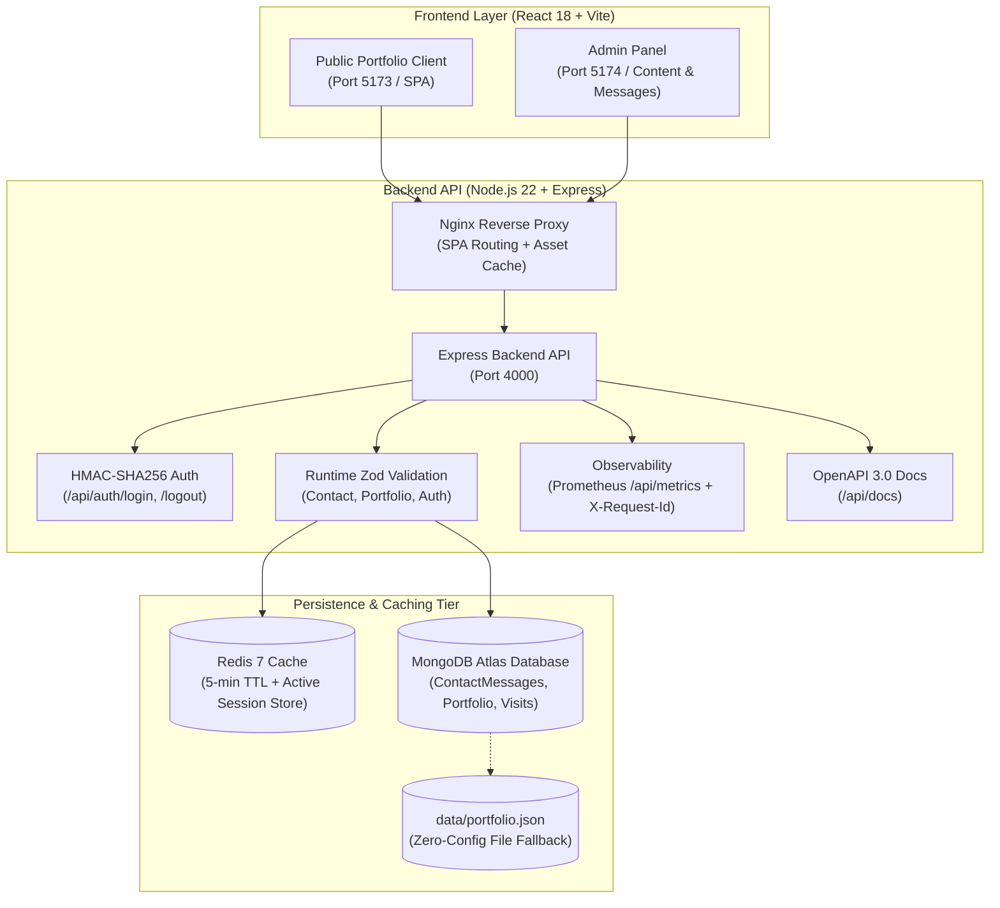

# 🚀 Aman Singh Kunwar — Personal Portfolio & Admin Panel

[](https://github.com/Aman-Singh-Kunwar/Portfolio/actions/workflows/ci.yml)


A full-stack developer portfolio and admin dashboard built with **React 18, Node.js/Express, TypeScript, Redis, MongoDB Atlas, and Tailwind CSS**. Includes a public portfolio website, an admin panel for updating content and managing contact messages, OpenAPI (Swagger) documentation, Prometheus metrics, and automated tests (unit, integration, and Playwright E2E).

---

## 🔗 Live Links

- **🌐 Live Client Portfolio**: [https://aman-singh-kunwar-portfolio1.onrender.com/](https://aman-singh-kunwar-portfolio1.onrender.com/)
- **🔐 Live Admin Panel**: [https://aman-singh-kunwar-portfolio2.onrender.com/admin](https://aman-singh-kunwar-portfolio2.onrender.com/admin)
- **⚙️ Live Backend API / Swagger**: [https://aman-singh-kunwar-portfolio.onrender.com/api/docs](https://aman-singh-kunwar-portfolio.onrender.com/api/docs)
- **🐙 GitHub Repository**: [https://github.com/Aman-Singh-Kunwar/Portfolio](https://github.com/Aman-Singh-Kunwar/Portfolio)

---

## 🏛️ System Architecture



---

## 🔒 Security & Defensive Controls

For an overview of the timing attack protection, CORS allowlist, rate limiting, and session revocation models implemented in this repository, see [**SECURITY.md**](SECURITY.md).

---

## ✨ Features & Architecture

### 🎨 1. Client Portfolio Website (`frontend/client`)
- **Career & Education Timeline**: Interactive chronological view for work experience and education history.
- **Skills Categorization**: Filterable technical skills grouped by `Frontend`, `Backend & DB`, and `CMS & Core`.
- **Case Study Modals**: Structured breakdowns of engineering decisions, problem statements, solutions, and trade-offs for featured projects.
- **Project & Certificate Lightboxes**: Image modal viewer with keyboard navigation (Esc, arrow keys) and thumbnail previews.
- **Resume Modal**: Inline PDF preview tab and plain-text version for quick review and 1-click clipboard copy.
- **Social Sharing**: Share modal for WhatsApp, LinkedIn, Twitter/X, Email, or direct URL copy.
- **SEO & Structured Metadata**: Dynamic Open Graph tags, JSON-LD structured data (`Person`, `WebSite`), `sitemap.xml`, and `robots.txt`.
- **Error Boundaries**: React Error Boundary wrappers to display graceful fallback states if a component fails.

### 🛠️ 2. Admin Panel (`frontend/admin`)
- **HMAC Session Authentication**: `POST /api/auth/login` generates signed HMAC session tokens stored with a 24-hour TTL in Redis/cache, paired with `POST /api/auth/logout` session revocation.
- **Content Editors**: Visual management forms to update projects, achievements, experience, education, and skills.
- **Raw JSON Editor**: Monaco/textarea editor with real-time JSON validation and live side-by-side preview.
- **Contact Messages Dashboard**: Inbound message management interface with status tags (`New`, `In Discussion`, `Archived`), direct mailto actions, and CSV export.
- **Basic Traffic Analytics**: 7-day visit counter and traffic summary chart on the main admin view.
- **Theme Accent Switcher**: Customizable UI accent palette (Amber, Emerald, Violet, Sky, Rose).

### ⚙️ 3. Backend API Service (`backend`)
- **REST Endpoints**: `/api/portfolio`, `/api/auth/login`, `/api/auth/logout`, `/api/contact`, `/api/visits`, `/api/metrics`, `/sitemap.xml`, and `/api/health`.
- **OpenAPI 3.0 Documentation**: Interactive Swagger explorer at `/api/docs` generated from OpenAPI specs.
- **Runtime Validation (Zod)**: Schema validation on all mutating request payloads (contact messages, auth credentials, portfolio updates).
- **Multi-Tier Caching (Redis + Memory)**: Redis adapter for session storage and caching with automatic in-memory fallback if Redis is unavailable, plus automatic cache invalidation on admin edits.
- **Prometheus Metrics**: Metrics endpoint at `GET /api/metrics` tracking request latency, status codes, and endpoint counters.
- **Security Middleware**: Constant-time token verification (`crypto.timingSafeEqual`), CORS origin allowlisting, IP rate limiting (`express-rate-limit`), security headers (`helmet` style), and gzip compression.
- **Structured Error Handling**: Centralized error middleware with unique `X-Request-Id` correlation headers on every response.

### 🐳 4. Docker Containerization
- **5-Service Compose Stack**: Orchestrates `mongo`, `redis`, `backend`, `client`, and `admin` with `docker compose up -d`.
- **Healthchecks**: Automated startup probes (`mongosh ping`, `redis-cli ping`) with `service_healthy` container dependency ordering.
- **Multi-Stage Builds**: Production Dockerfiles using Nginx for static frontend assets and lightweight Node.js Alpine base images for the backend.

---

## 🛠️ How This Was Built

This project was built to serve as a production-grade personal portfolio and content management system, replacing static templates with a fully dynamic, self-hosted architecture. The core objective was to separate the public client from administrative tooling, enforce strict runtime schema contracts across the stack with Zod, and ensure that every feature is backed by automated tests (unit, integration, and Playwright E2E).

I leveraged AI assistance as an active pair-programming tool throughout development. Specifically, AI was used to generate initial boilerplate for React management forms and tables, assist with Tailwind CSS styling and responsive layouts, write test fixtures and mock datasets, and help troubleshoot cross-platform CI edge cases (such as Linux CI runner working directory resolution, dual-stack IPv4/IPv6 port bindings, and OpenAPI 3.0 specs).

Building this system provided hands-on experience with production-level full-stack concepts: implementing constant-time HMAC token verification (`crypto.timingSafeEqual`) to prevent timing attacks, building a resilient multi-tier caching layer with Redis and in-memory fallbacks, managing cache invalidation lifecycles on database mutations, and orchestrating a 5-service Docker Compose environment with automated container healthchecks.

---

## 🛠️ Technology Stack

- **Frontend**: React 18, Vite, React Router 7, Tailwind CSS, React Icons
- **Backend**: Node.js 22, Express 4, Zod, Native Crypto (HMAC-SHA256), Swagger / OpenAPI 3.0
- **Database & Cache**: MongoDB Atlas (Mongoose), Redis 7 (with in-memory fallback)
- **Testing**: Playwright (E2E browser tests), Node.js native test runner (`node:test`)
- **DevOps & Tooling**: Docker, Docker Compose, Nginx, TypeScript, GitHub Actions CI

---

## 📂 Directory Structure

```txt
Portfolio/
├── backend/
│   ├── server.js              # Server entry point & graceful shutdown
│   └── src/
│       ├── app.js             # Express app configuration & middleware pipeline
│       ├── config.js          # Startup environment validation
│       ├── db.js              # Mongoose connection & fallback seeding
│       ├── docs/swagger.js    # OpenAPI 3.0 specification & Swagger UI
│       ├── middleware/        # Rate limiter, request logger, security headers, requireAdmin
│       ├── models/            # ContactMessage.js, Portfolio.js, VisitSession.js
│       ├── routes/            # auth.js, portfolio.js, contact.js, visits.js
│       ├── services/          # cache.js (Redis/Memory), portfolioStore.js, visitStore.js
│       ├── utils/             # http.js, logger.js, metrics.js, token.js
│       └── validators/        # schemas.js (Zod schemas), portfolio.js
├── data/
│   └── portfolio.json         # Default dataset (projects, experience, skills, education)
├── e2e/                       # Playwright browser test suite
│   ├── playwright.config.js   # Test runner & webServer orchestration
│   └── tests/                 # homepage.spec.js, contact.spec.js, admin.spec.js
├── frontend/
│   ├── client/                # Public portfolio React client
│   │   ├── src/
│   │   │   ├── components/    # SeoManager, ResumeModal, ShareModal, CaseStudyModal
│   │   │   ├── pages/         # Home.jsx, ProjectDetail.jsx, AchievementDetail.jsx
│   │   │   └── App.jsx
│   │   └── package.json
│   └── admin/                 # Admin management panel
│       ├── src/
│       │   ├── components/    # AdminLayout.jsx, ProtectedRoute.jsx, Icons.jsx
│       │   ├── context/       # AuthContext.jsx
│       │   ├── pages/         # DashboardPage, ProjectsPage, AchievementsPage, MessagesPage
│       │   └── App.jsx
│       └── package.json
├── types/
│   └── portfolio.d.ts         # Shared TypeScript contracts
├── docker-compose.yml         # 5-Service Docker Compose setup
├── tsconfig.json              # TypeScript configuration
└── README.md
```

---

## 🚀 Quick Start Guide

### 🐳 Option A: Docker Compose (Recommended)

```bash
docker compose up -d --build
```

| Service | Local URL |
|---|---|
| 🌐 **Client Portfolio** | `http://localhost:5173` |
| 🔐 **Admin Panel** | `http://localhost:5174` |
| ⚙️ **Backend Status Portal** | `http://localhost:4000` |
| 📖 **Swagger API Docs** | `http://localhost:4000/api/docs` |
| 📊 **Prometheus Metrics** | `http://localhost:4000/api/metrics` |

---

### 🛠️ Option B: Local Setup

#### Prerequisites
- Node.js (v22+)
- MongoDB (Atlas or local instance; optional in dev — falls back to `data/portfolio.json`)
- Redis (optional in dev — falls back to in-memory cache)

### 1. Backend Service

```bash
cd backend
npm install
npm run dev
```

Create `backend/.env` (optional in dev):

```env
PORT=4000
NODE_ENV=development
MONGO_URI=your_mongodb_connection_string
REDIS_URL=redis://localhost:6379
ADMIN_TOKEN=your_admin_token
CORS_ORIGINS=http://localhost:5173,http://localhost:5174
API_URL=http://localhost:4000
CLIENT_URL=http://localhost:5173
ADMIN_URL=http://localhost:5174
```

### 2. Client Application

```bash
cd frontend/client
npm install
npm run dev
```

Runs locally at `http://localhost:5173`.

### 3. Admin Panel

```bash
cd frontend/admin
npm install
npm run dev
```

Runs locally at `http://localhost:5174`.

---

## 🧪 Testing Suite

This repository includes automated tests covering backend API endpoints, frontend architecture, and browser user flows:

```bash
# 1. Run Unit & Integration Tests (Backend, Client, Admin)
npm test

# 2. Run Playwright E2E Browser Tests
npm run test:e2e

# 3. Launch Interactive Playwright UI Studio
npm run test:e2e:ui

# 4. Run TypeScript Typecheck
npm run typecheck

# 5. Run Syntax Checks
npm run check
```

---

## 🔄 CI Pipeline

Continuous Integration runs on GitHub Actions ([`.github/workflows/ci.yml`](.github/workflows/ci.yml)) on every push to `main`:
1. **Dependency Installation**: Clean install across root, backend, client, and admin workspaces.
2. **Syntax Validation**: `node --check` validation across all backend modules.
3. **Type Safety**: `tsc --noEmit` validation against shared TypeScript contracts.
4. **Integration Tests**: Node.js test runner executing backend and frontend unit/integration test suites.
5. **Production Builds**: `vite build` compilation for both client and admin SPAs.
6. **E2E Browser Tests**: Playwright launching Chromium and executing real user flows against preview servers.
7. **Container Config Validation**: `docker compose config` validation.
8. **Security Audit**: Dependency vulnerability scan (`npm audit --audit-level=high`).

---

## 📄 License

MIT License — [LICENSE](LICENSE)
