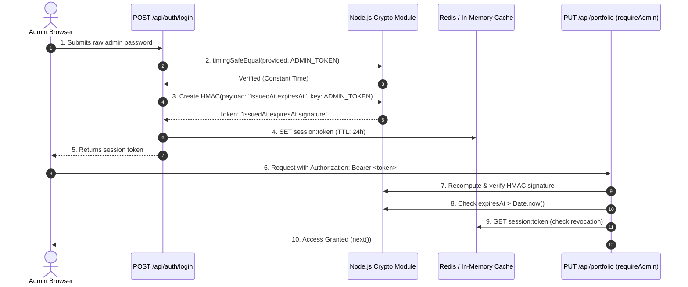

# 🔐 System Deep-Dive: HMAC Session Authentication

---

## 1. What It Does in Plain Language

Instead of passing the master admin password in HTTP headers for every request, this system generates a **cryptographically signed, time-limited session token** upon successful login, and stores active session IDs in a server-side cache.



---

## 2. Anatomy of the Session Token

A generated token consists of 3 dot-separated components:

$$\text{Token} = \underbrace{\text{1718000000000}}_{\text{issuedAt Timestamp}} \;.\; \underbrace{\text{1718086400000}}_{\text{expiresAt Timestamp}} \;.\; \underbrace{\text{a1b2c3d4...}}_{\text{HMAC-SHA256 Signature}}$$

1. **`issuedAt`**: Millisecond timestamp when the session was created.
2. **`expiresAt`**: Millisecond timestamp when the session expires (24 hours after creation).
3. **`HMAC-SHA256 Signature`**: A cryptographic digest created by hashing `${issuedAt}.${expiresAt}` with the server's private `ADMIN_TOKEN`.

---

## 3. Key Defensive Techniques in Code

### A. Constant-Time Comparison (`crypto.timingSafeEqual`)
In [`backend/src/routes/auth.js`](../backend/src/routes/auth.js) and [`backend/src/utils/token.js`](../backend/src/utils/token.js):
```javascript
function safeEqual(a, b) {
  const aBuffer = Buffer.from(a);
  const bBuffer = Buffer.from(b);
  if (aBuffer.length !== bBuffer.length) return false;
  return crypto.timingSafeEqual(aBuffer, bBuffer);
}
```
- **Why**: Standard JavaScript `===` terminates at the first mismatched byte. An attacker sending thousands of probe requests can measure microsecond timing differences to determine how many leading characters of their guess were correct (a **timing attack**). `timingSafeEqual` always takes the exact same number of CPU cycles.

### B. Immediate Server-Side Revocation
In [`backend/src/routes/auth.js`](../backend/src/routes/auth.js):
```javascript
router.post("/logout", requireAdmin, asyncHandler(async (req, res) => {
  const token = extractBearerToken(req);
  await cache.del(`session:${token}`);
  return res.json({ success: true, message: "Session revoked." });
}));
```
- **Why**: Pure stateless JWTs cannot be revoked without changing the master secret. Storing the active token in Redis/cache lets the server delete the session on logout, instantly disabling the token for all future requests.

---

## 4. Comparison with Alternatives

| Architecture | Trade-offs & Limitations | Why We Chose HMAC + Redis |
|---|---|---|
| **Raw Password in Headers** | Extreme risk. If a single log file or network inspector captures the header, the master secret is permanently compromised. | Tokens expire automatically in 24 hours and can be invalidated on demand. |
| **Full OAuth2 / Auth0 / Supabase** | High complexity, external service fees, network roundtrips, and unnecessary third-party dependencies for a single-admin portfolio. | Zero external dependencies; uses native Node.js cryptography with sub-millisecond local execution. |
| **Stateless JWT (No Cache Store)** | Cannot be revoked on logout. If an admin token is leaked on a public computer, it remains valid until expiration. | Combines cryptographic tamper-proofing with instant server-side revocation in Redis. |

---

## 5. What Breaks If It Fails?

| Failure Mode | Behavior & Result |
|---|---|
| **`ADMIN_TOKEN` missing in `.env`** | Boot-time validation throws a fatal error, preventing the server from starting with an insecure default. |
| **Redis server crashes** | The cache service falls back to the internal `Map` in memory. Active sessions in that server process continue working without throwing 500 errors. |
| **Attacker modifies expiration timestamp** | The recalculated HMAC signature over the modified payload will not match the provided signature. The server immediately rejects it with `401 Unauthorized`. |

---
