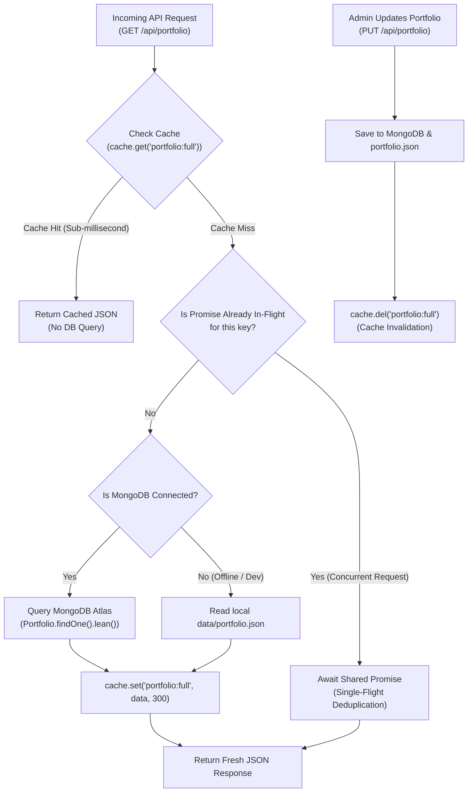

# ⚡ System Deep-Dive: Multi-Tier Redis Caching Layer

---

## 1. What It Does in Plain Language

This system provides a **cache-aside (lazy-loading) layer** with multi-tier storage:
- It uses a shared **Redis 7** instance in production or Docker environments.
- It automatically falls back to an **in-memory `Map`** with TTL timestamps when Redis is unavailable (e.g. during local testing or CI runners).
- It implements a **Single-Flight (Promise Deduplication) pattern** in `getOrSet` to prevent duplicate concurrent database queries within the same process during a cache miss.



---

## 2. Code Architecture (`backend/src/services/cache.js`)

### A. Automatic Connection & Fault Tolerance
```javascript
async init(redisUrl) {
  if (!redisUrl) {
    logger.info("cache", { mode: "in-memory", message: "In-memory cache initialized" });
    return;
  }
  try {
    const { createClient } = await import("redis");
    this.redisClient = createClient({ url: redisUrl });
    this.redisClient.on("error", (error) => {
      this.isRedisReady = false;
      logger.warn("cache: redis error, using in-memory fallback", { error: error.message });
    });
    await this.redisClient.connect();
    this.isRedisReady = true;
  } catch (err) {
    this.redisClient = null;
    this.isRedisReady = false;
  }
}
```
- **Why Dynamic Import?**: `await import("redis")` allows the backend to start and test in environments where the optional Redis package isn't installed.
- **Error Listener**: The `.on("error")` handler prevents unhandled connection errors from crashing the entire Node.js server process.

### B. Single-Flight In-Flight Promise Deduplication (`getOrSet`)
```javascript
async getOrSet(key, factoryFn, ttlSeconds = 300) {
  const cached = await this.get(key);
  if (cached !== null) return cached;

  // Single-flight: If a request for this key is already executing, reuse its promise
  if (this.inFlight.has(key)) {
    return await this.inFlight.get(key);
  }

  const executionPromise = (async () => {
    try {
      const fresh = await factoryFn();
      await this.set(key, fresh, ttlSeconds);
      return fresh;
    } finally {
      this.inFlight.delete(key);
    }
  })();

  this.inFlight.set(key, executionPromise);
  return await executionPromise;
}
```
- **How It Works**: If 100 concurrent requests arrive during a cache miss, the first request invokes `factoryFn()`. The other 99 requests find the pending promise in `this.inFlight` and `await` the exact same promise without querying MongoDB 100 separate times.

---

## 3. Comparison with Alternatives

| Caching Strategy | Trade-offs & Limitations | Why We Chose Multi-Tier Cache |
|---|---|---|
| **Direct DB Query on Every Request** | High latency (50–150ms per request), exhausts MongoDB connection pools, incurs Atlas data transfer costs. | Caching portfolio data reduces response times to `< 2ms` and protects the database. |
| **Static Memory Cache Only (`global.cache = {}`)** | Memory caches cannot be shared across multiple Docker containers or serverless instances, and they vanish on restarts. | Redis enables horizontal scaling across multiple instances, while the in-memory fallback ensures zero-config local development. |
| **HTTP Browser Caching Only (`Cache-Control: max-age=3600`)** | If an admin updates their portfolio, users with cached browser copies will see outdated content for an hour. | Server-side caching combined with `ETag` and instant eviction (`cache.del`) ensures visitors always see updates immediately. |

---

## 4. What Breaks If It Fails?

| Failure Mode | Truthful Explanation & Behavior |
|---|---|
| **Redis network disconnection** | The `.on("error")` hook sets `this.isRedisReady = false`. Future cache requests immediately route to the in-memory `Map` with zero downtime. |
| **Admin publishes new project but cache isn't evicted** | Visitors would see stale portfolio data until the 5-minute TTL expires. Calling `cache.del("portfolio:full")` on every write solves this. |
| **Cache Stampede (Single Node / Process)** | Handled via **Single-Flight In-Flight Promise Deduplication** in `getOrSet`. Multiple concurrent requests on the same process share a single in-flight database query. |
| **Cache Stampede (Distributed Clustered Nodes)** | Note: Process-level single-flight deduplication protects a single Node process. Across multiple clustered horizontal containers, a distributed mutex (e.g. Redis `SET NX PX` or Redlock) would be required to prevent inter-node thundering herds. |

---
