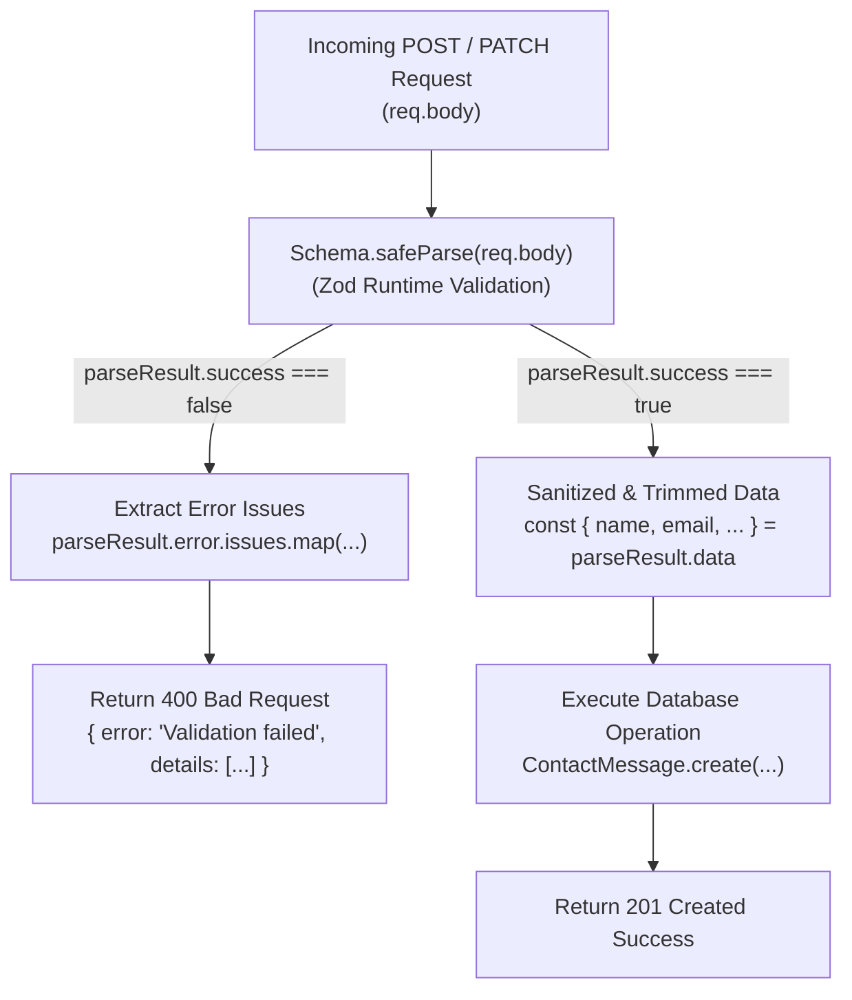

# 🛡️ System Deep-Dive: Runtime Zod Validation Layer

---

## 1. What It Does in Plain Language

JavaScript and Express by default treat all request body payloads (`req.body`) as untyped objects. Without strict validation, missing fields, malicious property injections, or malformed data types can crash the server, corrupt database documents, or create security vulnerabilities.

This system uses **Zod schemas** to enforce strict compile-time types, runtime schema contracts, whitespace trimming, and descriptive error formatting at the API boundary before any database operation executes.



---

## 2. Schema Architecture (`backend/src/validators/schemas.js`)

### A. Contact Form Schema
```javascript
export const ContactSubmissionSchema = z.object({
  name: z.string().trim().min(2, "Name must be at least 2 characters").max(100),
  email: z.string().trim().email("A valid email address is required").toLowerCase(),
  subject: z.string().trim().min(2, "Subject must be at least 2 characters").max(200),
  message: z.string().trim().min(10, "Message must be at least 10 characters").max(5000)
});
```
- **`.trim()`**: Removes leading/trailing spaces before evaluating string length.
- **`.toLowerCase()`**: Normalizes email addresses to prevent duplicate casing bugs.
- **`.max(...)`**: Protects database storage from buffer-overflow or large payload spam.

### B. Controlled Status Update Enum
```javascript
export const StatusUpdateSchema = z.object({
  status: z.enum(["new", "in_discussion", "interview_scheduled", "archived"], {
    errorMap: () => ({ message: "Invalid status value provided" })
  }),
  notes: z.string().max(1000).optional()
});
```
- **Strict Enum**: Restricts CRM pipeline updates strictly to 4 whitelisted states.

---

## 3. Comparison with Alternatives

| Validation Method | Trade-offs & Limitations | Why We Chose Zod |
|---|---|---|
| **Manual `if (!req.body.name)` Checks** | Verbose, brittle, easy to forget fields, and requires dozens of repetitive lines per route. | Declarative schemas define rules in one place with automatic error mapping. |
| **Mongoose Schema Validation Only** | Mongoose validates only when saving to MongoDB. It does not validate auth tokens, query params, or non-database endpoints, and produces cryptic Mongoose errors. | Validates at the controller boundary before hitting the database, providing clean user-friendly JSON error messages. |
| **Joi / Yup** | Older libraries with heavier bundle sizes and weaker TypeScript type inference. | Zod provides static TypeScript type inference (`z.infer<typeof Schema>`) alongside runtime validation. |

---

## 4. What Breaks If It Fails?

| Failure Mode | Prevention Mechanism in Code |
|---|---|
| **NoSQL Operator Injection (`{ "$gt": "" }`)** | `z.string()` ensures the input is strictly a primitive string and rejects objects/arrays, preventing MongoDB operator injection. |
| **Excessively Large Payloads (Denial of Service)** | `.max(5000)` prevents attackers from sending megabyte-long text strings that consume server memory. |
| **Silent Type Coercion** | Zod does not silently convert unexpected types (like converting an array to a string) unless explicitly configured, ensuring strict data integrity. |

---
